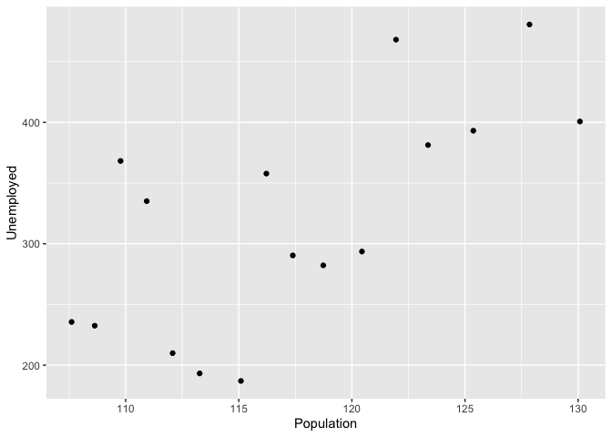
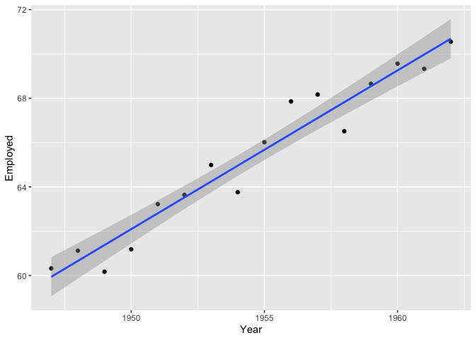
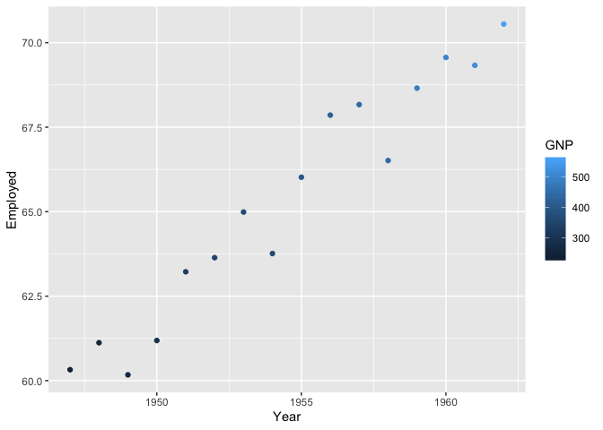
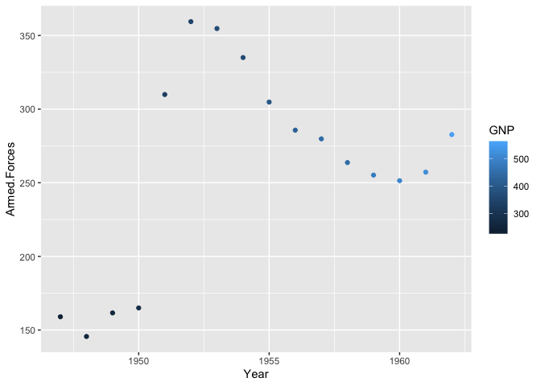
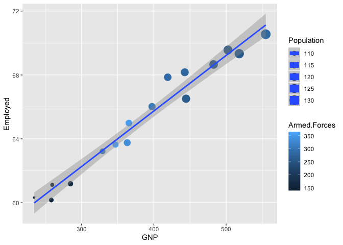
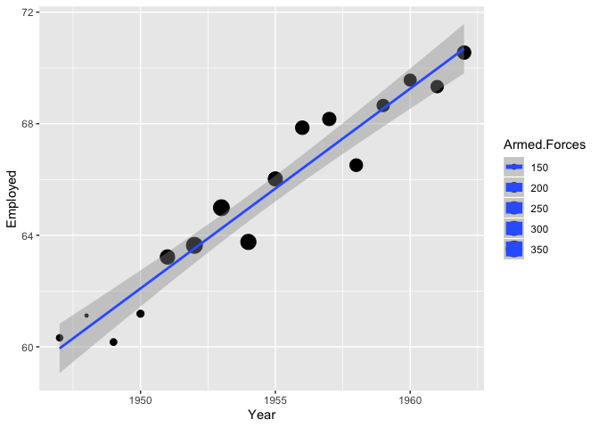
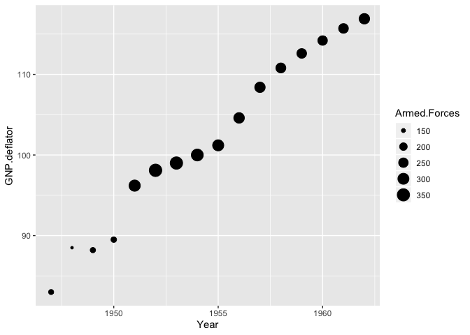
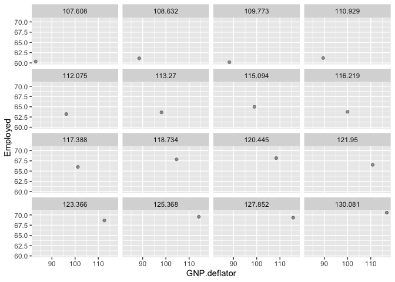
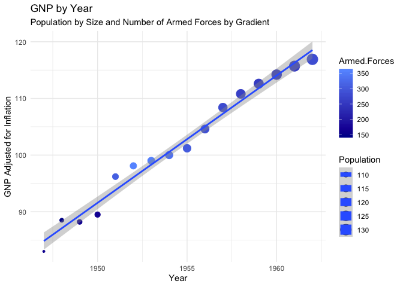

\#\#Introduction

I started as I normally do, trying to find a dataset that interests me
in my field. I find it hard to find marketing data that makes sense as
most quality data needs to be paid for. The sets I do find usually have
some sort of questionable background, leaving me unsure of what to be
asking about them. For instance, I saw a set (several really) on kaggle
that was about banks marketing- however this was done in protugue and
some of the variables were hard to wrap my head around. I also am not
able to access work data quite yet. I did make attempts to use an
Avocado dataset from Kaggle, however I didnt really have a question/
interest in this data and there seemed to be not ony a massive amount of
varaibles to try and plot, but also some gaps in the data. Next I
attempted to use R datasets such as OJ and USArrests, again though they
were not working out.

The data I settled on was R’s Longley’s Economic Regression Data. While
is is a macroeconomc data set that is well know for a highly collinear
regression, I needed to settle on something and this ecomomic dataset
has some interesting variables, such as GNP rather then GDP and number
of people in the armed forces. The data was not very timley as it was
from 1947 to 1962, but again as I am not big on ecomonics it did
interest me in the slightest and I thought it would result in some nice
visuals to help me with my questions. I was cuirious if an increased
number of armed forces affect the GNP? how is GNP affected over time by
populated and those unemployed vs. employed. I very likely already know
these answers do to the high collinear regression, however it is still
interesting to explore how these factors might affect a countries
overall economic standings.

\#The
    Data

``` r
longley
```

    ##      GNP.deflator     GNP Unemployed Armed.Forces Population Year Employed
    ## 1947         83.0 234.289      235.6        159.0    107.608 1947   60.323
    ## 1948         88.5 259.426      232.5        145.6    108.632 1948   61.122
    ## 1949         88.2 258.054      368.2        161.6    109.773 1949   60.171
    ## 1950         89.5 284.599      335.1        165.0    110.929 1950   61.187
    ## 1951         96.2 328.975      209.9        309.9    112.075 1951   63.221
    ## 1952         98.1 346.999      193.2        359.4    113.270 1952   63.639
    ## 1953         99.0 365.385      187.0        354.7    115.094 1953   64.989
    ## 1954        100.0 363.112      357.8        335.0    116.219 1954   63.761
    ## 1955        101.2 397.469      290.4        304.8    117.388 1955   66.019
    ## 1956        104.6 419.180      282.2        285.7    118.734 1956   67.857
    ## 1957        108.4 442.769      293.6        279.8    120.445 1957   68.169
    ## 1958        110.8 444.546      468.1        263.7    121.950 1958   66.513
    ## 1959        112.6 482.704      381.3        255.2    123.366 1959   68.655
    ## 1960        114.2 502.601      393.1        251.4    125.368 1960   69.564
    ## 1961        115.7 518.173      480.6        257.2    127.852 1961   69.331
    ## 1962        116.9 554.894      400.7        282.7    130.081 1962   70.551

``` r
?longley #A macroeconomic data set which provides a well-known example for a highly collinear regression.A data frame with 7 economical variables, observed yearly from 1947 to 1962 (n=16).
```

GNP is the GNP (Gross National Product) is a measure of national income.
It is the market value of all goods and services created in a given year
by labor and property that belong to the citizens of a given country. It
measures how much the goods and services that are produced cost.

\#some visuals

``` r
ggplot(data = longley,aes(x = Population, y = Unemployed))+
  geom_point()
```

<!-- -->

``` r
ggplot(longley, aes(x=Year, y=Employed)) +
  geom_point() + stat_smooth(method="lm") #adding a loess line with a linear regression model 
```

<!-- -->

``` r
ggplot(longley, aes(x=Year, y=Employed, color = GNP)) +
  geom_point()  # looking at # of those employeed over time ( year ) showing the GNP increase visually in color 
```

<!-- -->

``` r
ggplot(longley, aes(x=Year, y=Armed.Forces, color = GNP)) +
  geom_point()  # same as the last but with armed forces # it looks like maybe there is a gap in the data or something else is occuring
```

<!-- -->

``` r
ggplot(data = longley, aes(x= GNP, y = Employed, color = Armed.Forces, size = Population)) +
  geom_point() + 
  stat_smooth( method = lm) # this is sort of interesting, a liner regression model with a loess line showing the employement number by GNP, we also see the size of armed forces prevenalt with the color variation, dark being less light being more, but it gets a little intese with population also being reflected in the size of the data points, the bigger the point the larger the population 
```

<!-- -->

``` r
ggplot(data = longley, aes(x= Year, y = Employed, size = Armed.Forces)) +
  geom_point() + 
  stat_smooth( method = lm) # I wonder if those employed are also counted as those in Armed.Forces 
```

<!-- -->

``` r
ggplot(data = longley, aes(x= Year, y = GNP.deflator, size = Armed.Forces)) +
  geom_point()  # I wonder if those employed are also counted as those in Armed.Forces, in 1947-53 we have the Cold War, in the 60's there was the cuban missle crisis and the vietnam war 
```

<!-- -->

``` r
ggplot(data = longley, mapping=  aes(x= GNP.deflator, y = Employed)) +
  geom_point( alpha = .4) + 
  stat_smooth( method = lm) + 
  facet_wrap(~Population) # that was useless 
```

<!-- -->

# In Conclusion :

``` r
p2<-ggplot(data = longley, aes(x= Year, y = GNP.deflator, color = Armed.Forces, size = Population)) +
  geom_point() + 
  stat_smooth( method = lm)+
  xlab("Year")+
  ylab("GNP Adjusted for Inflation") +
  ggtitle("GNP by Year", subtitle = "Population by Size and Number of Armed Forces by Gradient")+
  theme_minimal()

p2+scale_color_gradient(low="#000099", high="#6699FF")
```

<!-- -->

``` r
?longley
```

This graph is maybe a little confusing at first, and takes a few minutes
to figure out, if I were presenting this I would definitly have made
soemthing a little simplier (only one type of scale versus two) I think
I liked this becuase it helped me to awnser some questions I originally
had and it even brought one to the forefront of my data. Even though I
knew the data was a highly correlated regression, I was able to visually
see that as as the over the years GNP.deflator ( adjsuted GNP )
increased, as did the population while you can see a spike in the number
of armed forced increased around 1950-1955 then decreases (which makes
sense as we know that the Cold War was occuring) If the data continued
on I bet we would see the number of armed forces get lighter in color as
the Vietnam War would then be starting. Overall I was was able to
visually see GNP increase do to a few factors, which make sense as the
more our population grows the more we produce and the occurance of war
also influences an increase in production ( just more war time items ).
Overall, I created a visual to help me with my questions and am now left
wondering if the numebr of armed forces is double counted in the number
of people also employed.
